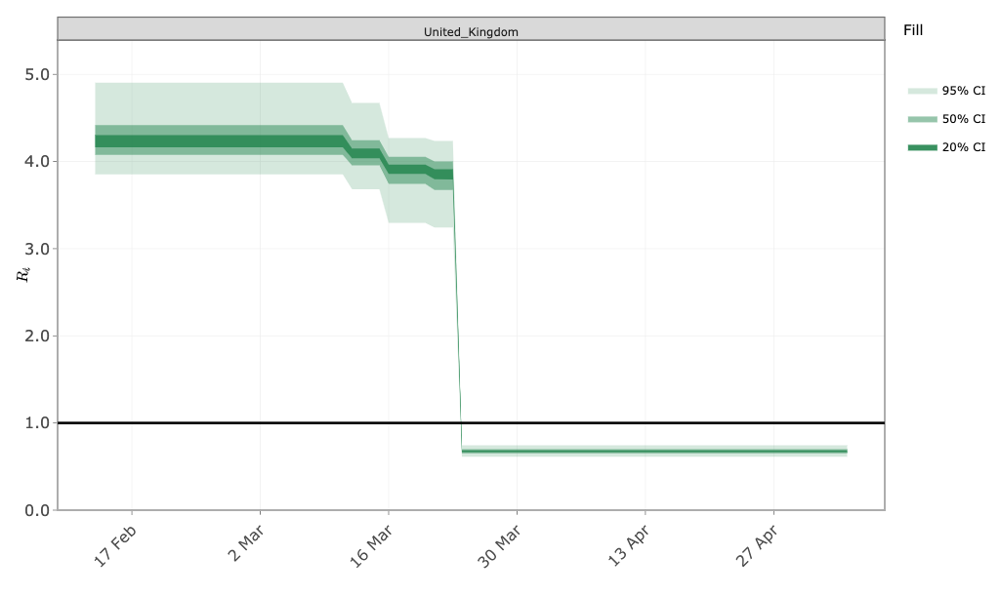
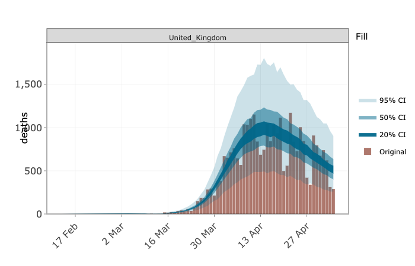

epidemia
================

The epidemia package allows researchers to flexibly specify and fit
Bayesian epidemiological models in the style of [Flaxman et
al. (2020)](https://www.nature.com/articles/s41586-020-2405-7). The
package leverages R’s formula interface to paramaterize the time-varying
reproduction rate as a function of covariates. Multiple populations can
be modeled simultaneously with hierarchical models. The design of the
package has been inspired by, and has borrowed from,
[rstanarm](https://mc-stan.org/rstanarm/) (Goodrich et al. 2020).
epidemia uses [rstan](https://mc-stan.org/rstan/) (Stan Development Team
2020) as the backend for fitting models.

This is an early beta release of the package. If you are interested in
taking part in beta testing, please [fill out this form](https://forms.gle/PT4JtLs4e3KdLkdp7).

## Disclaimer

As a beta release, there will be regular updates with additional
features and more extensive testing. Any feedback is greatly appreciated
- in particular if you find bugs, find the documentation unclear, or
have feature requests, please report them
[here](https://github.com/ImperialCollegeLondon/epidemia/issues).

## Installation

Once you have access to the repository, clone it and install from
source. We recommend avoiding installation of any vignettes as these are
computationally demanding, and are best viewed online.

## Getting Started

The best way to get started is to read the
[vignettes](articles/index.html).

  - [Flexible Epidemic Modeling with
    epidemia](articles/introduction.html) is the main vignette,
    introducing the model framework and the primary model fitting
    function `epim`.
  - [Using Priors](articles/priors.html) gives important details behind 
    using prior distributions for model paramters.
  - [Incidence Only](articles/IncidenceOnly.html) gives examples of
    fitting models using only incidence data and a discrete serial
    interval.
  - [Time-Dependent Modeling](articles/TimeDependentR.html) demonstrate
    how to model weekly changes in the reproduction number as a random
    walk.
  - [Resolving Problems](articles/ResolvingProblems.html) will
    demonstrate how to resolve common computational problems when using the package.

## Usage

``` r
library(epidemia)
options(mc.cores=parallel::detectCores())

data(EuropeCovid)
# Collect args for epim
args <- EuropeCovid
args$algorithm <- "sampling"
args$group_subset <- c("Germany", "United_Kingdom")
args$sampling_args <- list(iter=1e3,control=list(adapt_delta=0.95,max_treedepth=15),seed=12345)
args$formula <- R(country, date) ~ schools_universities + self_isolating_if_ill +
  public_events + lockdown + social_distancing_encouraged
args$prior <- shifted_gamma(shape = 1/6, scale = 1, shift = -log(1.05)/6)
fit <- do.call("epim", args)
```



``` r
# Inspect Rt
plot_rt(fit, group = "United_Kingdom", levels = c(25,50,75,95))
# And deaths
plot_obs(fit, type = "deaths", group = "United_Kingdom", levels = c(25,50,75,95))
```


